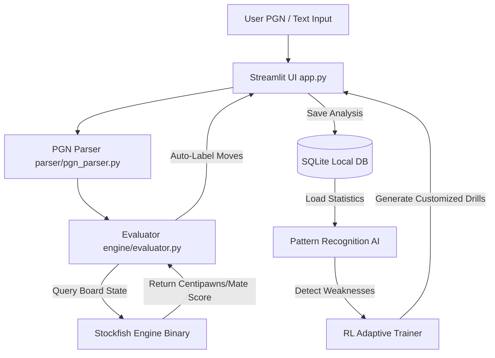

# ♟️ Chezzy - Chess Analyzer & Adaptive RL Trainer

Chezzy adalah platform bertenaga AI untuk menganalisis taktik permainan catur Anda secara mendalam menggunakan engine catur **Stockfish**, mendeteksi kelemahan taktis Anda secara statistik, dan memberikan latihan (_drill_) adaptif berbasis Reinforcement Learning (RL).

---

## 🏗️ System Architecture



---

## 🚀 Fitur Utama

- **Auto-Labeling Evaluasi**: Menilai langkah catur Anda dengan akurasi tinggi (_Brilliant, Great, Good, Inaccuracy, Mistake, Blunder_).
- **Deteksi Pola Kelemahan**: Menganalisis riwayat permainan catur Anda untuk mencari area yang perlu ditingkatkan (misalnya: pertahanan sayap menteri, blunder di fase endgame).
- **RL-based Adaptive Drills**: Sistem akan menyajikan taktik catur (_puzzle_) adaptif yang disesuaikan secara dinamis dengan titik kelemahan Anda.

---

## 🛠️ Tech Stack

- **Language**: Python 3.12+
- **Frontend/UI**: Streamlit
- **Chess Logic & Subprocess**: `python-chess`
- **Database**: SQLite3
- **Local Engine**: Stockfish UCI Chess Engine

---

## 🔒 Keamanan & File `.env`

> [!WARNING]
> **PENTING**: File `.env` berisi konfigurasi lokal (seperti absolute path ke binary Stockfish Anda) yang unik untuk setiap komputer.
> **Jangan pernah meng-upload file `.env` ke GitHub!**
>
> File `.env` sudah didaftarkan ke dalam [.gitignore](file:///D:/kuliah/Project-After-Lulus/chess-analyzer/.gitignore). Sebagai gantinya, gunakan [.env.example](file:///D:/kuliah/Project-After-Lulus/chess-analyzer/.env.example) sebagai template konfigurasi bagi kolaborator atau saat melakukan deployment di komputer lain.

---

## 📦 Panduan Instalasi & Setup

### 1. Kloning Repositori

```bash
git clone https://github.com/username/chess-analyzer.git
cd chess-analyzer
```

### 2. Setup Virtual Environment & Install Dependensi

```bash
# Membuat virtual environment
python -m venv .venv

# Mengaktifkan venv (Windows)
.venv\Scripts\activate

# Mengaktifkan venv (macOS/Linux)
source .venv/bin/activate

# Menginstall library
pip install -r requirements.txt
```

### 3. Konfigurasi Stockfish

Unduh dan pasang Stockfish di komputer Anda:

#### **Windows**

1. Unduh binary resmi dari [stockfishchess.org/download](https://stockfishchess.org/download/).
2. Ekstrak ZIP ke folder lokal Anda.
3. Salin [.env.example](file:///D:/kuliah/Project-After-Lulus/chess-analyzer/.env.example) menjadi `.env` lalu isi path ke file `.exe` Stockfish:
   ```env
   STOCKFISH_PATH="D:/chess/stockfish/stockfish-windows-x86-64-avx2.exe"
   ```

#### **macOS**

Cukup gunakan Homebrew untuk instalasi otomatis ke system `PATH`:

```bash
brew install stockfish
```

_(Evaluator akan langsung berjalan tanpa konfigurasi `.env`)_

#### **Linux (Ubuntu/Debian)**

Cukup gunakan package manager:

```bash
sudo apt update && sudo apt install stockfish
```

_(Evaluator akan langsung berjalan tanpa konfigurasi `.env`)_

---

### 4. Konfigurasi Tambahan (Opsional)

Selain `STOCKFISH_PATH`, Anda juga dapat mengatur konfigurasi berikut di file `.env`:

```env
# Kedalaman pencarian analisis engine Stockfish (Default: 15)
STOCKFISH_DEPTH=15

# Lokasi penyimpanan database SQLite (Default: data/games.db di folder project)
DB_PATH="D:/kuliah/Project-After-Lulus/chess-analyzer/data/games.db"
```

---

## 🚀 Cara Menjalankan Aplikasi

Setelah semua instalasi dan konfigurasi selesai, jalankan aplikasi web Streamlit dengan perintah berikut:

```bash
streamlit run app.py
```

Aplikasi akan berjalan secara lokal dan dapat diakses di browser Anda di alamat `http://localhost:8501`.

---

## 🗺️ Roadmap Pengembangan Project

Berikut adalah roadmap bertahap pengembangan Chess Analyzer:

### 📍 Phase 1 — MVP (Minimum Viable Product) `[1-2 Minggu]`

- [x] Setup struktur folder project dan konfigurasi dependensi.
- [x] Konektivitas Stockfish Evaluator dengan custom error-handling.
- [ ] Implementasi PGN Parser untuk mengolah data input catur.
- [ ] Pembuatan visualisasi board catur interaktif menggunakan Streamlit.
- [ ] Logika penentuan label move otomatis (_Brilliant / Good / Inaccuracy / Mistake / Blunder_).
- [ ] Database SQLite lokal untuk menyimpan histori permainan catur yang dianalisis.

### 📍 Phase 2 — Pattern Recognition `[Minggu 3-4]`

- [ ] Analisis statistik performa game dari database.
- [ ] Deteksi pola taktis otomatis berbasis statistik sederhana:
  - _Mendeteksi fase permainan terlemah (Opening, Middlegame, Endgame)._
  - _Mengidentifikasi kelemahan posisional (misal: "lemah dalam defend queenside" atau "struktur pawn rusak")._
- [ ] Dashboard ringkasan profil kelemahan pemain (Visual charts).

### 📍 Phase 3 — RL / Adaptive Feedback `[Pengembangan Lanjut]`

- [ ] Penerapan modul Reinforcement Learning (seperti _Q-Table_ sederhana atau _Multi-Armed Bandit Algorithm_).
- [ ] Pembuatan generator _puzzle/drill_ adaptif berdasarkan profil kelemahan Phase 2.
- [ ] Sistem skor reward:
  - _Menyelesaikan latihan taktis yang tepat sasaran memberikan skor._
  - _Skor meng-update status state profil pemain secara dinamis._
- [ ] Rekomendasi taktik yang semakin cerdas seiring bertambahnya game yang dimainkan.

---

## ⚡ Lisensi

Project ini berlisensi di bawah **MIT License**.
